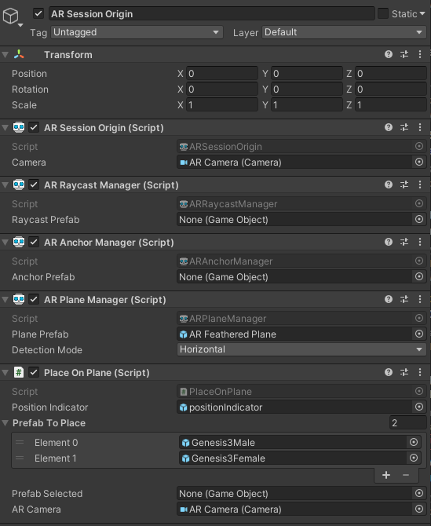

# Technical documentation

## Setting up the project

*Some of the step below may be unnecessary*

First when you open the project make sure that you have an LTS Unity install with ios or Android build support.

First be sure that the ARfoundation package is installed in the unity project with the ARCore XR plugin or ARkit XR plugin (depending for which you want to compile)

For this project i used those video to get started

[ARFoundation Tutorial from the youtube channel Anton Developer](https://www.youtube.com/watch?v=foiDeTHwHxQ)

[Unity and ARfoundation setup for Android](https://www.youtube.com/watch?v=0mpsiO2lCx0)

[ARFoundation documentation](https://docs.unity3d.com/Packages/com.unity.xr.arfoundation@4.1/manual/index.html)

## AR scene

Several game object are required to make an AR scene, like an AR camera , an AR Session and an AR Session Origin. And with those gameObject several components and Scripts

## 3D scene
